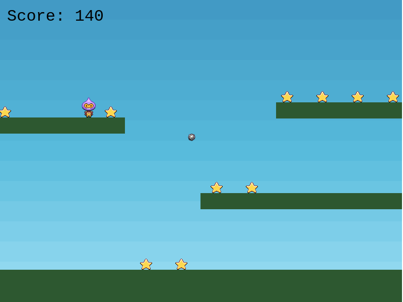

# Collect a star
---

## About

A game where a character collect a star to gain a points.

## Features

The features of this game are:

- Player should collect the star to get the point.
- When a player collects all the stars one bomb will appear randomly and start bouncing.
- Player have to avoid the bouncing bomb and collect the star as much as they can.
- When the player collides with the bomb the game is over.

## Game Instructions

**Movement instruction:**
- Player can use `left` (&#8592;) arrow key to move left.
- Player can use `right` (&#8594;) arrow key to move right.
- Player can use `up` (&#8593;) arrow key to jump.

Player have to collect as many stars as they can to get score. When player collect one star they get 10 points and when they collect every stars then one bomb appears randomly in the screen and they have to avoid colliding with the bomb to survive.

## Live Demo

This project is hosted on netlify.

[Live demo link]()

## Built With

- JavaScript (ES6)
- Webpack
- Phaser

## Getting Started

### Installation instructions

Follow along the steps below to get a copy at your local machine.

- Clone the repo.
- Navigate to the `collect-a-star` directory
- Install the npm package with `npm install`
- Start the server with `npm run start`
- The site should automatically open on your browser at http://localhost:8080/ if it didn't, then open your browser with that link.

## Authors

👤 **Dipesh Bajgain**

- GitHub: [@dipbazz](https://github.com/dipbazz)
- Twitter: [@dipbazz](https://twitter.com/dipbazz)
- LinkedIn: [Dipesh Bajgain](https://www.linkedin.com/in/dipbazz/)

## 🤝 Contributing

Contributions, issues, and feature requests are welcome!

## Show your support

Give a ⭐️ if you like this project!

## Acknowledgments

- I built this game by following the tutorial [Making your first Phaser 3 game](http://phaser.io/tutorials/making-your-first-phaser-3-game/part1)

## 📝 License

This project is [MIT](./LICENSE) licensed.
